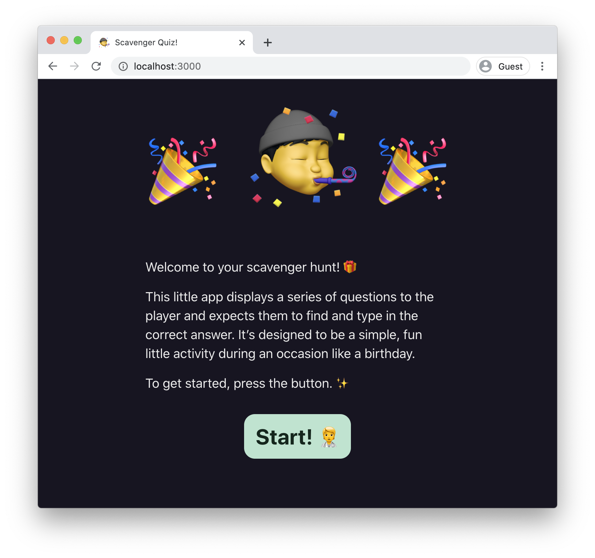
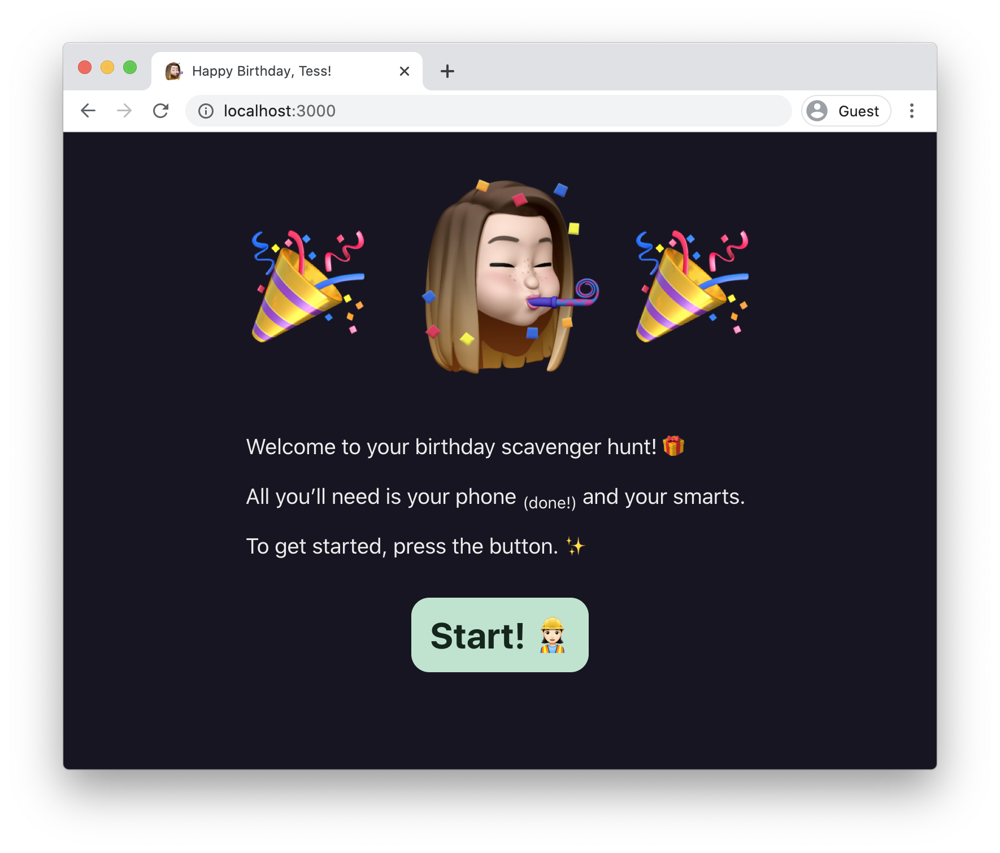

# react-scavenger-hunt

`react-scavenger-hunt` is a small React SPA written in TypeScript that displays an interactive, linear quiz intended to be used during (something akin to) a birthday present scavenger hunt. You can pull down this repo, write your own questions and answers, and use it yourself!



In action:


## Features

-   Scalable to any number of questions
-   Questions can accept more than one valid answer
-   Full JSX support for rich, dynamic question content
-   Progress saved in browser, so you can leave and resume where you left off
-   Responsive, works great in a phone browser
-   Fully open source and modifiable — tweak it exactly how you want it

## Origin

I built this little quiz app in the first month of COVID-19 lockdown as a present for my partner and a way to keep in practice with React while I was looking for a new job. I've stripped the personal stuff from this repo and generalized it so anyone familiar with JSX can use it to make their own quiz.

Here's how the original quiz looked:



## Getting started

First, clone this repo to a machine with NodeJS and NPM installed. Then, in the repo directory:

```zsh
$ npm i -g yarn
$ yarn
```

There shouldn't be much limitation re: Node/Yarn version, but this was developed against Node 12.

### Creating your own quiz

It's pretty easy to get started making your own quiz. I’d follow these steps:

1. Edit `src/data/QuizData.tsx`, which contains the questions and answers for your quiz. Read through the ones already there, since they explain the supported features for question authoring.
    1. You can also change the emojis that cycle through on the start button by modifying the `START_BUTTON_EMOJIS` array in this file.
1. The main Animoji image in the middle of the header can be swapped by replacing the images in `public/images`. I used my partner's Memoji.
1. Change the `<title>` to a custom message, if you want.

### Develop & build

The project is based on [create-react-app](https://github.com/facebook/create-react-app), so the build toolchain should be familiar if you've used that before.

#### Develop locally

```zsh
$ yarn start
```

This spawns a server at localhost:3000 with hot module reloading.

#### Build for production

```zsh
$ yarn build
```

Built assets are written to the `build` directory. Point a static file server like [serve](https://github.com/vercel/serve) to that directory and you're good to go.

## Docker 

In order to use this project inside a docker container, just do:

```zsh
docker build -t react-scavenger-quiz .
docker run -d -p 3000:80 react-scavenger-quit
```

Now you can access the quiz at http://&lt;ip-of-docker-server&gt;:3000/
